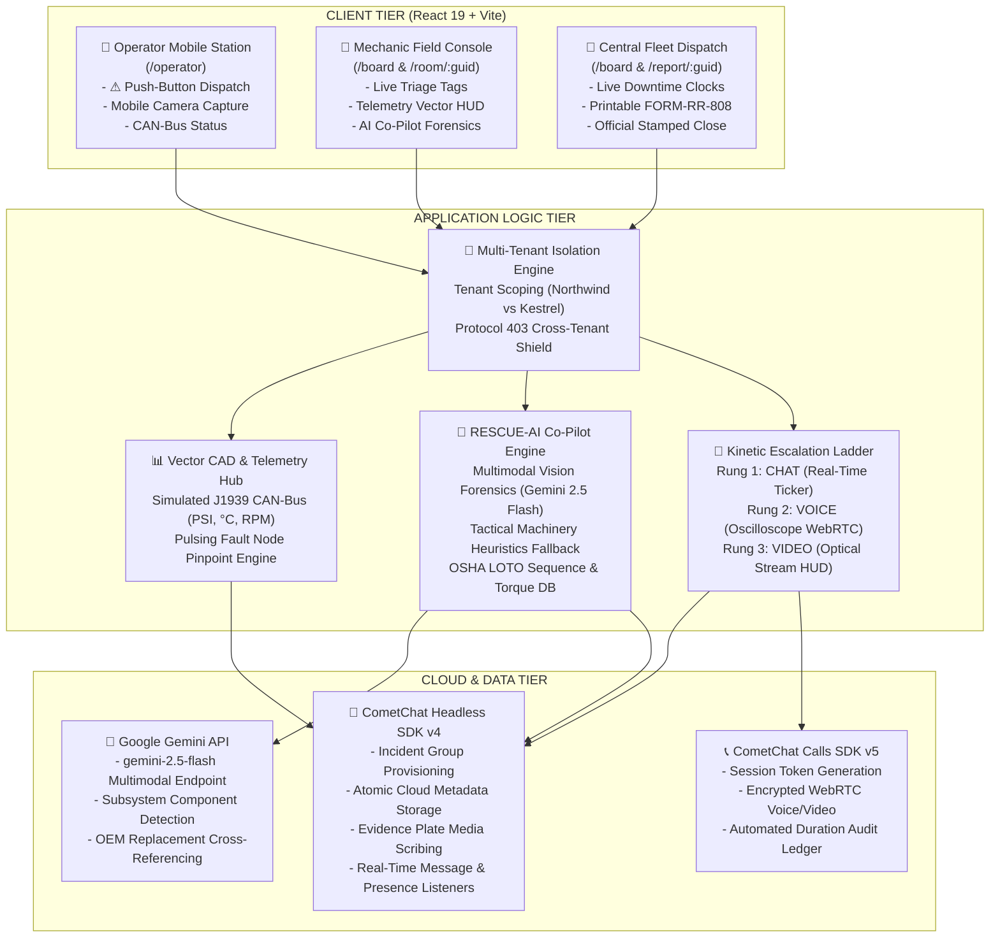

# 🚨 RescueRoom — Live Field Machinery Emergency Dispatch & Diagnostics Platform

<div align="center">


-61DAFB?style=for-the-badge&logo=react&logoColor=black)


<p align="center">
  <strong>Mission-critical incident command, live telemetry HUDs, visual failure forensics, and real-time audio/video escalation built for heavy earthmoving equipment and industrial fleet transport.</strong>
</p>

[Key Features](#-signature-platform-features) •
[System Architecture](#-system-architecture) •
[Data Flow](#-data-flow--incident-lifecycle) •
[Interactive Telemetry HUD](#-equipment-telemetry-hud--vector-cad-schematics) •
[AI Machinery Co-Pilot](#-ai-machinery-co-pilot--evidence-plate-decoder) •
[Quickstart](#-installation--local-setup) •
[Multi-Tenant Scenarios](#-multi-tenant-personnel--demo-credentials)

</div>

---

## 📖 1. Executive Summary & Aesthetic Philosophy

### The Real-World Challenge
In mining pits, quarry excavations, and container terminals, **every minute of machinery downtime costs upwards of $2,500/hour**. When a 45-ton excavator ruptures a main hydraulic boom line or a haul truck loses retarder pressure, operators and technicians face hostile environments:
- **Direct Sunlight Glare**: High-contrast outdoor screens are unreadable with washed-out pastel UI.
- **Mud, Grease & Dirty Gloves**: Tiny rounded buttons and hidden kebab menus cause accidental taps or failure to dispatch.
- **Communication Breakdown**: Phone calls lack telemetry context; text messages fail to transmit high-pressure safety procedures and exact OEM part numbers.

### The "Field Manual" Solution
**RescueRoom** intentionally rejects modern generic rounded-corner purple SaaS templates in favor of a hand-crafted **Field Manual Design System**:
* **Tactile Paper & Ink Palette**: Authentic physical bone workshop paper (`#EFE8D8`), deep industrial ink lines (`#1C1B18`), sharp mechanical 90° corners, and zero-blur hard offset shadows (`3px 3px 0px #1C1B18`).
* **High-Visibility Emergency Signals**: Vermilion alert triggers (`#E4421E`), hazard-stripe caution tape (`#F2B705`), oxidised teal verification stamps (`#1F6F68`), and tactical night-vision dark panels (`#14201F`).
* **Engineering Typography**: Google Fonts **Bricolage Grotesque** (bold stencil manual headings) and **IBM Plex Mono** (military UTC timestamps, CAN-bus codes, and serial markings).

---

## 🏗️ 2. System Architecture

RescueRoom is built on a resilient, multi-tiered architecture that pairs **CometChat's Headless JavaScript SDK and Calling WebRTC infrastructure** with **Google Gemini 2.5 Flash** failure diagnostics and a pure Vanilla CSS design system.



---

## 🔄 3. Data Flow & Incident Lifecycle Workflow

```mermaid
sequenceDiagram
    autonumber
    actor Operator as 🚜 Field Operator
    participant App as 💻 RescueRoom Client
    participant CometChat as ☁️ CometChat Cloud
    participant AI as 🧠 Gemini 2.5 Flash
    actor Mechanic as 🔧 Field Mechanic
    actor Dispatcher as 📡 Fleet Dispatcher

    Operator->>App: Hits giant vermilion "⚠ SOMETHING'S WRONG"
    App->>CometChat: CometChat.createGroup(guid, metadata)
    Note over CometChat: Cloud metadata scribes equipment, severity, description & openedAt
    CometChat-->>App: Group Created (INC-8821)
    App->>CometChat: Safe broadcast of Initial Dispatch Report
    CometChat->>Mechanic: Triage Board receives GroupListener event; pins tag live
    Mechanic->>App: Clicks pinned card; enters Incident Room
    App->>CometChat: ensureGroupJoined(guid) auto-membership sync
    App->>App: Telemetry HUD renders CAD schematic & pulses failed subsystem (Boom Cylinder)
    Operator->>App: Captures high-res photo via mobile camera
    App->>CometChat: sendMediaMessage(Evidence Plate 01)
    Mechanic->>App: Clicks [🤖 AI DAMAGE SCAN] on Evidence Plate
    App->>AI: Transmits image payload + incident telemetry to Gemini 2.5 Flash
    AI-->>App: Returns JSON forensics (Catastrophic burst, Parker P/N, LOTO checklist, 145 Nm torque)
    Mechanic->>App: Clicks "📡 TRANSMIT AI REPORT TO COMETCHAT"
    App->>CometChat: Broadcasts formatted forensics briefing to group ticker
    Mechanic->>App: Climbs Escalation Ladder: CHAT -> VOICE
    App->>CometChat: CometChatCalls.generateToken(guid)
    Note over Mechanic,Operator: WebRTC live radio frequency connects with audio oscilloscope
    Mechanic->>App: Concludes repair; clicks "✕ END CALL"
    App->>CometChat: Scribes automated call duration log to ledger
    Dispatcher->>App: Clicks "✓ RESOLVE INCIDENT"
    App->>CometChat: updateGroup(metadata with status='resolved')
    Note over App: Rubber stamp animation slams down in oxidised teal ink
    Dispatcher->>App: Opens /report/:guid; prints official FORM-RR-808 PDF
```

---

## ⚡ 4. Signature Platform Features

### 🧗 1. The Kinetic Escalation Ladder
A physical 3-rung tactical ladder embedded into the left control rail of every incident room:
* **Rung 1: CHAT**: Monospace printed ticker log with military timestamps (`[HH:MM:SS UTC]`), typing indicators, and user presence dots.
* **Rung 2: VOICE**: Instant two-way group tactical radio call with live audio oscilloscope waveform visualizer, active speaker highlighting, and frequency tuning display (`47.8 MHz`).
* **Rung 3: VIDEO**: Full tactical optical video stream with camera mirroring, optical crosshair HUD overlay, and hardware mic/camera mute toggles.
* **Automated Audit Logging**: When a call is concluded, the exact duration is automatically calculated and scribed into the permanent chat record (e.g. `📞 TACTICAL VOICE CALL TERMINATED · DURATION: 04:12`).

### 📋 2. The Triage Board (`/board`)
An operational board organized into 3 physical paper tag severity columns:
* **`CRITICAL SEVERITY`**: Immediate work stoppage (Vermilion header `#E4421E`).
* **`SERIOUS SEVERITY`**: Reduced equipment capacity / safety risk (Hazard Yellow header `#F2B705`).
* **`MINOR ADVISORY`**: Routine operational fault report (Paper Light header `#F7F3E9`).
* **Tag Mechanics**:
  * Pinned mechanical square pin-head (`.triage-pin-head`).
  * **Live Counting Downtime Timers**: Monospace counter ticking second-by-second (`HH:MM:SS`) since the fault occurred.
  * **Conversations API Unread Count Pills**: Real-time unread badges (`● 3 NEW` vs `✓ CAUGHT UP`).
  * **Oldest-Waiting Highlight**: The longest unaddressed incident in each column receives an `8px` vermilion highlighted edge (`.triage-tag-oldest`) and a `★ LONGEST WAITING IN QUEUE` stamp.
  * **Real-Time Group Listeners**: New incidents pin themselves live via CometChat event listeners without page refreshes.

### 📊 3. Equipment Telemetry HUD & Vector CAD Schematics
An interactive instrument cluster and blueprint viewer:
* **CAD Vector Blueprints**: High-precision vector technical schematics for Excavators, Bulldozers, Haul Trucks, Wheel Loaders, Freightliner, Telehandlers, and Forklifts.
* **Pulsing Radar Fault Pinpoint**: Concentric animated radar rings (`PINPOINT 01 ACTIVE`) lock onto the exact failed component.
* **Click-to-Inspect Nodes**: Click any subsystem to view operating pressure, bore size, fluid flow, and nominal limits.
* **Direct Technical Inquiries**: Click *"DISPATCH INQUIRY TO CHAT"* on any component to inject a structured query straight into CometChat.
* **Simulated CAN-Bus J1939 Instruments**: Live animated gauges for Hydraulic Pressure (PSI), Coolant/Slew Temp (°C), and Engine RPM with realistic micro-jitter dynamics and redline safety alarms.

### 🤖 4. AI Machinery Co-Pilot & Failure Analysis Engine
A forensics engine powered by **Google Gemini 2.5 Flash** with an offline **Tactical Engineering Heuristics Engine** fallback:
* **Multimodal Visual Evidence Decoding**: Analyzes uploaded photos to detect structural failure modes (high-pressure carcass rupture, cyclic shock loading, elastomer degradation).
* **OEM Parts Procurement Matrix**: Exact OEM part numbers (Caterpillar, Komatsu, Parker Hannifin, Bosch Rexroth, Bendix, Holset) with estimated unit costs and warehouse lead times.
* **OSHA Lockout/Tagout (LOTO) Sequence**: Interactive checkable 6-step isolation checklist (relieving tank pressure, lowering implements, padlocking 24V battery isolators).
* **Calibrated Fastener Torque Specs**: OEM factory torque ratings (Nm, ft-lb) and lubrication requirements.
* **One-Click CometChat Broadcast**: Dispatches the entire AI forensic briefing directly into the incident stream so all personnel stand by with exact specs.

### 📸 5. Numbered Evidence Plates
* Native mobile camera capture (`capture="environment"`) and desktop file picker.
* Strict 5MB file validation and photographic MIME enforcement.
* Photographic print styling: heavy ink border, sequential serial markings (`PLATE 01`, `PLATE 02`), timestamp, and operator signature.
* Full-screen inspection lightbox modal with direct `[ 🤖 RUN AI FORENSICS SCAN ]` launch button.

### 📄 6. Auto-Generated Printable Service Report (`/report/:guid`)
* Reconstructs an official physical workshop maintenance report (`FORM-RR-808`).
* **4 Metric Tiles**: Time to First Responder, Total Downtime Duration, Evidence Plates Scribed, and Call Minutes Logged.
* **Diagnostic Narrative**: Plain-language engineering diagnosis synthesized from telemetry.
* **Chronological Incident Event Ledger**: Minute-by-minute audit trail (Dispatched $\to$ First Responder $\to$ Evidence Scribed $\to$ Radio/Video Call $\to$ Officially Resolved).
* **Embedded Evidence Plate Gallery**: High-resolution thumbnails with full inspection modals.
* **CAD Schematic Diagnosis & OEM Parts Manifest**: Reconstructed engineering blueprint snapshot and verified parts order table.
* **Workshop Sign-off Block**: Lead technician signature line, supervisor stamp, and certified archive seal.
* **Physical Print & PDF Export**: High-contrast `@media print` CSS formats the document cleanly for physical paper filing and PDF generation.

### 🛡️ 7. Strict Multi-Tenant Isolation & 403 Lockdown Shields
Complete data segregation between independent corporate workspaces:
1. **Northwind Heavy Equipment** (Mining & Excavation Fleet)
2. **Kestrel Logistics** (Warehouse & Transport Fleet)
* **Scoping Architecture**: All user UIDs (`northwind_ravi` vs `kestrel_dev`) and group GUIDs (`northwind_inc_*` vs `kestrel_inc_*`) are strictly prefixed.
* **Protocol 403 Lockdown Shields**: If a user attempts to enter a foreign company incident room or inspect an external service report, an automated **Security Lockdown Card** halts navigation and preserves corporate confidentiality.

---

## 💻 5. Tech Stack & Engineering Decisions

| Layer | Technology | Rationale & Implementation Details |
| :--- | :--- | :--- |
| **Framework** | **React 19 (`^19.2.8`)** | High-performance component tree, concurrent rendering, and native hook-driven lifecycle. |
| **Bundler** | **Vite 8 (`^8.3.0`)** | Lightning-fast HMR, optimized production tree-shaking, and sub-second build times. |
| **Routing** | **React Router v7 (`^7.18.4`)** | Declarative route architecture with dynamic parameter routing (`/room/:guid`, `/report/:guid`). |
| **Chat & Messaging** | **CometChat Headless JS SDK v4 (`^4.2.0`)** | Direct API usage on top of `@cometchat/chat-sdk-javascript` without restrictive pre-baked UI shells. |
| **Voice & Video** | **CometChat Calls JS SDK v5 (`^5.0.6`)** | WebRTC encrypted audio/video calling, token generation, and hardware session management. |
| **AI Forensics** | **Google Gemini 2.5 Flash** | Multimodal visual failure analysis, structured JSON generation, and OEM parts extraction. |
| **Styling** | **Pure Vanilla CSS (Zero Tailwind)** | Hand-crafted CSS tokens (`design-tokens.css` & `field-manual.css`) providing 100% control over the Field Manual aesthetic. |
| **Typography** | **Google Fonts (Bricolage + Plex Mono)** | Industrial typography pairing for rugged readability in harsh physical environments. |

### Architectural Decision: CometChat Cloud Metadata Storage
Rather than maintaining an external relational database (PostgreSQL/MongoDB) that could fall out of sync with chat rooms, RescueRoom leverages **CometChat Group Metadata** as its primary system of record:
1. **Atomic State Coupling**: `{ status, severity, equipment, openedAt, resolvedAt, resolvedBy }` live directly inside the CometChat group object.
2. **Zero Synchronization Drift**: Transcripts, evidence plates, call records, and resolution timestamps remain completely unified.
3. **Multi-Client Real-Time Distribution**: Any technician or dispatcher fetching the group (`CometChat.getGroup`) or querying channels (`CometChat.GroupsRequestBuilder`) receives the latest state immediately.

---

## 📁 6. Folder & File Structure

```text
RescueRoom/
├── .env                              # CometChat & Google Gemini credentials
├── index.html                        # Application entry with Google Fonts preconnect
├── package.json                      # Project dependencies & scripts
├── vite.config.js                    # Vite build configuration
├── README.md                         # Comprehensive project documentation
├── src/
│   ├── main.jsx                      # React 19 root bootstrap
│   ├── App.jsx                       # Routing matrix, session restoration & auth sync
│   ├── App.css                       # Root application styling
│   ├── index.css                     # Global base styles
│   ├── components/
│   │   ├── index.js                  # Centralized component export hub
│   │   ├── Navbar.jsx                # Sticky military header, clock, workspace badge & AI status
│   │   ├── TelemetryHUD.jsx          # Interactive vector CAD schematics & CAN-bus gauges
│   │   └── AiCopilotModal.jsx        # Multimodal Gemini failure analysis, LOTO & torque modal
│   ├── lib/
│   │   ├── cometchat.js              # CometChat Chat & Calls SDK singleton, re-auth & safe dispatch
│   │   ├── gemini.js                 # Gemini 2.5 Flash API connector & Tactical Engineering Heuristics
│   │   └── seed.js                   # Multi-tenant operational scenario seeder (4 realistic incidents)
│   ├── pages/
│   │   ├── LoginPage.jsx             # Multi-tenant operational roster selector (6 personnel)
│   │   ├── OperatorPage.jsx          # "⚠ SOMETHING'S WRONG" push-button emergency dispatch station
│   │   ├── TriageBoardPage.jsx       # Pinned paper tag command board with live aging timers & unread pills
│   │   ├── RoomPage.jsx              # Kinetic Escalation Ladder, live ticker feed, evidence plates & calls
│   │   └── ServiceReportPage.jsx     # Official printable maintenance service report (FORM-RR-808)
│   └── styles/
│       ├── design-tokens.css         # Core 6-color palette, typography, hard shadows & borders
│       └── field-manual.css          # Physical stamps, rubber seals, hazard tape & print rules
```

---

## 👥 7. Multi-Tenant Personnel & Demo Credentials

RescueRoom features 6 operational demo personas pre-configured for instant one-click login across two independent corporate fleets:

| Workspace | Name | Role | Callsign | Access Route | Responsibilities |
| :--- | :--- | :--- | :--- | :--- | :--- |
| **Northwind Heavy Equipment** | Asha Patil | Operator | `OP-LEAD` | `/operator` | Heavy excavator operations; pushes emergency dispatch |
| **Northwind Heavy Equipment** | Ravi Kumar | Mechanic | `TECH-NORTH-09` | `/board` | Hydraulics & diesel lead; climbs ladder & repairs faults |
| **Northwind Heavy Equipment** | Meera Sen | Dispatcher | `DISPATCH-01` | `/board` | Central yard supervisor; resolves incidents & certifies reports |
| **Kestrel Logistics** | Dev Malhotra | Operator | `YARD-CHIEF` | `/operator` | Freightliner fleet driver; dispatches transport emergencies |
| **Kestrel Logistics** | Sana Sheikh | Mechanic | `MOBILE-TECH` | `/board` | Powertrain & electrical tech; inspects air brake chambers |
| **Kestrel Logistics** | Imran Baig | Dispatcher | `KESTREL-BASE` | `/board` | Regional logistics controller; archives work orders |

### Pre-Seeded Incident Scenarios
Upon opening the Triage Board for either company, the built-in seeder (`src/lib/seed.js`) provisions authentic operational incident tickets:
* **INC-8821 (CRITICAL)**: Hydraulic main boom line rupture on Excavator EX-204 / Freightliner FL-90.
* **INC-7412 (SERIOUS)**: Track tension cylinder pressure drop under heavy blade load on Bulldozer BD-801.
* **INC-6109 (MINOR)**: Auxiliary alternator warning light flickering during cycle dump on Haul Truck HT-310.
* **INC-5204 (RESOLVED)**: Bucket hydraulic cylinder seal replacement verified and archived.

---

## 🚀 8. Installation & Local Setup

### Prerequisites
* **Node.js**: v18.0.0 or higher (tested on Node v20 / v22)
* **npm**: v9.0.0 or higher
* Modern web browser (Chrome, Edge, Firefox, Brave, Safari) with WebRTC support.

### 1. Clone the Repository
```bash
git clone https://github.com/Neerav02/RescueRoom.git
cd RescueRoom
```

### 2. Configure Environment Variables
Create a `.env` file in the root directory:
```env
# CometChat Application Credentials (Required)
VITE_COMETCHAT_APP_ID=16843505914f60cbb
VITE_COMETCHAT_REGION=in
VITE_COMETCHAT_AUTH_KEY=cc35ff3816d06739765c7994842d0971fff65d80

# Google Gemini API Key (Optional - Fallback Heuristic Engine active by default)
VITE_GEMINI_API_KEY=
```

> [!NOTE]
> If `VITE_GEMINI_API_KEY` is left blank, RescueRoom's built-in **Tactical Machinery Engineering Engine** automatically handles all failure forensics, OEM part lookups, and LOTO steps offline with zero setup friction! Technicians can also enter their Gemini key dynamically inside the in-app AI settings tab.

### 3. Install Dependencies
```bash
npm install
```

### 4. Start Development Server
```bash
npm run dev
```
Open your browser and navigate to **`http://localhost:5173`**.

### 5. Build for Production
```bash
npm run build
npm run preview
```

---

## 🧪 9. Step-by-Step Judge Evaluation Walkthrough

Follow this 5-minute evaluation script to test the complete end-to-end incident lifecycle:

1. **Log In as Operator**:
   - Navigate to `http://localhost:5173/login`.
   - Select **Asha Patil (Operator)** under Northwind Heavy Equipment and click **AUTHORIZE STATION**.
   - You arrive at the Operator Station (`/operator`).
2. **Trigger an Emergency**:
   - Click the giant vermilion **"⚠ SOMETHING'S WRONG"** button.
   - Equipment defaults to `Excavator EX-204` with `CRITICAL` severity.
   - Enter description: *"Main boom high pressure line burst. Oil loss and complete implement stoppage."*
   - Click **TRANSMIT EMERGENCY DISPATCH →**. You are immediately routed into the new Incident Room (`/room/northwind_inc_XXXX`).
3. **Inspect the Telemetry CAD Schematic**:
   - Observe the live CAN-bus telemetry bar at the top (fluctuating at `5,120 PSI` and `108°C`).
   - Click **`▼ BLUEPRINT & GAUGES`** to expand the vector CAD blueprint.
   - Notice the **pulsing red radar ping** locking directly onto the **Main Boom Cylinder**.
   - Click the node to inspect cylinder bore and pressure envelopes, then click **"DISPATCH INQUIRY TO CHAT"**.
4. **Switch Persona to Mechanic (Ravi Kumar)**:
   - Click **SWITCH USER** in the top navbar and log in as **Ravi Kumar (Mechanic)**.
   - On the **Triage Board (`/board`)**, locate Asha's newly dispatched ticket under the `CRITICAL SEVERITY` column with its live timer counting downtime second-by-second.
   - Click **OPEN DISPATCH ROOM →**.
5. **Run AI Failure Forensics on Evidence Plate**:
   - Upload a machinery photo using **📸 CAMERA** or desktop file attach (or click on an existing plate).
   - Click the yellow **`[ 🤖 AI DAMAGE SCAN ]`** button directly beneath the plate.
   - Review Tab 1: Component identification, root-cause failure mechanics, and OEM replacement parts table (e.g. Cat P/N `154-8291`). Click **"COPY P/N"**.
   - Review Tab 2: Check off steps in the **OSHA LOTO Safety Isolation Sequence**.
   - Review Tab 3: Inspect calibrated fastener torque ratings (`145 Nm`).
   - Click **"📡 TRANSMIT AI REPORT TO COMETCHAT"** and watch the complete forensic report scribed to the message ticker in real time!
6. **Climb the Escalation Ladder**:
   - In the left rail, click **2. VOICE** to escalate to voice radio mode.
   - Observe the dark tactical panel, audio oscilloscope waveform, and live call timer.
   - Click **3. VIDEO** to engage optical stream with crosshair HUD overlay.
   - Click **✕ END CALL & RETURN TO CHAT**. Notice the automated call duration audit log (`📞 TACTICAL VOICE CALL TERMINATED · DURATION: 00:24`) scribed to the message ticker.
7. **Resolve Incident & Export Service Report**:
   - In the top header, click **✓ RESOLVE INCIDENT**.
   - Watch the physical rubber seal slam down in oxidised teal ink (`INCIDENT WORK ORDER COMPLETED & CLOSED`).
   - Click **📄 VIEW SERVICE REPORT →**.
   - Inspect the reconstructed `FORM-RR-808`, including the 4 KPI metric tiles, the CAD blueprint snapshot, and the verified OEM parts procurement order.
   - Click **🖨 PRINT / EXPORT PDF SERVICE REPORT** to see the clean, high-contrast `@media print` layout.

---

## 🛠️ 10. CometChat MCP Tools Integration Audit Log

Throughout the architectural development of RescueRoom, the **CometChat Model Context Protocol (MCP)** server was queried live to ground every implementation detail in official, verified documentation:

```text
[MCP AUDIT TRAIL]
1. Tool: search_cometchat_docs
   - Query: "updateGroup JavaScript SDK"
   - Output: Confirmed group metadata structure, permissions, and group update lifecycle.
2. Tool: fetch_cometchat_doc_page
   - Target: "/sdk/javascript/llms-javascript-v4"
   - Output: Verified SDK v4 root architecture, AppSettingsBuilder, and presence subscriptions.
3. Tool: search_cometchat_docs
   - Query: "addGroupListener GroupListener JavaScript SDK"
   - Output: Retrieved real-time group event callbacks for live Triage Board pinning.
4. Tool: search_cometchat_docs
   - Query: "getUnreadMessageCount JavaScript SDK"
   - Output: Retrieved ConversationsRequestBuilder methods to power real-time unread pills.
5. Tool: fetch_cometchat_doc_page
   - Target: "/sdk/javascript/all-real-time-listeners"
   - Output: Implemented MessageListener, UserListener, and OngoingCallListener callbacks.
6. Tool: search_cometchat_docs
   - Query: "CometChatCalls generateToken init JavaScript SDK"
   - Output: Verified CometChatCalls v5 WebRTC token generation and session management.
```

---

## 🗺️ 11. Future Roadmap & Enhancements

- [ ] **Offline P2P Mesh Radio Synchronization**: Local peer-to-peer message buffering via WebRTC DataChannels for subterranean mine tunnels without cellular backhaul.
- [ ] **Thermal FLIR Camera Pipeline**: Integration with mobile FLIR One thermal imaging cameras to auto-detect hydraulic overheating zones and turbo manifold cracks.
- [ ] **Augmented Reality (AR) Overlay**: WebXR camera view projecting exploded 3D CAD models over the physical machine engine bay.
- [ ] **Automated ERP Parts Procurement**: Direct webhooks into SAP / Oracle NetSuite to automatically order verified OEM replacement parts upon incident resolution.

---

## 📄 12. License & Hackathon Declaration

* **Submission**: CometChat Global AI & Communication Hackathon 2026
* **Developer**: Neerav ([@Neerav02](https://github.com/Neerav02))
* **License**: MIT License — open for industrial research, heavy machinery field testing, and fleet operations.

---

<div align="center">
  <sub>RescueRoom · Field Manual Emergency Dispatch Infrastructure · Certified Industrial Communications 2026</sub>
</div>
