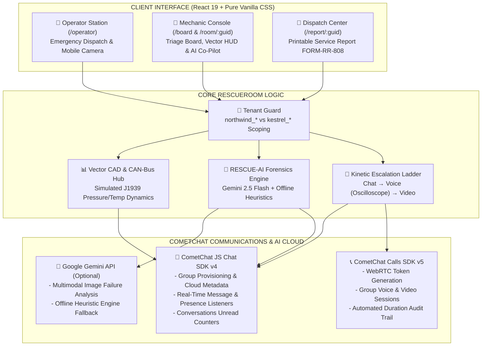

# 🚨 RescueRoom — Live Field Equipment Emergency Dispatch & Diagnostics

<div align="center">

-E4421E?style=for-the-badge)


-61DAFB?style=for-the-badge&logo=react&logoColor=black)


<p align="center">
  <strong>Emergency incident response, live telemetry HUDs, visual failure diagnostics, and real-time audio/video escalation for heavy equipment operations.</strong>
</p>

[⚡ 5-Minute Judge Walkthrough](#-5-minute-judge-evaluation-walkthrough) •
[Demo Accounts](#-demo-accounts--credentials) •
[System Architecture](#-system-architecture) •
[Features](#-key-features) •
[Local Setup](#-installation--local-setup) •
[MCP Integration](#-cometchat-mcp-integration-audit)

</div>

---

## ⚡ 5-Minute Judge Evaluation Walkthrough

Follow this quick sequence to test the entire lifecycle across Chat, Voice, Video, AI, and Telemetry:

### 1. Log In as Operator (Asha Patil)
1. Open [`http://localhost:5173/login`](http://localhost:5173/login).
2. Click **Asha Patil (Operator)** under **Northwind Heavy Equipment** $\to$ click **AUTHORIZE STATION**.
3. You land on the Operator Emergency Station (`/operator`).

### 2. Dispatch an Emergency Incident
1. Click the large vermilion button: **"⚠ SOMETHING'S WRONG"**.
2. Select equipment (`Excavator EX-204`), severity (`CRITICAL`), and describe the fault:  
   *"Hydraulic line ruptured near boom cylinder. High-pressure leak, immediate shutdown."*
3. Click **TRANSMIT EMERGENCY DISPATCH →**. You are immediately routed into the new Incident Room.

### 3. Inspect Live Telemetry HUD & CAD Blueprint
1. In the Incident Room, view the top **Telemetry HUD** showing live CAN-bus readouts (simulated PSI, Temp, RPM).
2. Click **`▼ BLUEPRINT & GAUGES`** to open the CAD schematic.
3. Notice the **pulsing red radar pinpoint** locking onto the failed **Main Boom Cylinder**. Click the node to inspect specs, then click **"DISPATCH INQUIRY TO CHAT"** to post an inquiry into the ticker.

### 4. Switch to Mechanic (Ravi Kumar) & Run AI Diagnostics
1. Click **SWITCH USER** in the navbar $\to$ select **Ravi Kumar (Mechanic)** $\to$ log in.
2. On the **Triage Board (`/board`)**, locate the incident under **CRITICAL SEVERITY** with its live downtime timer ticking up.
3. Click **OPEN DISPATCH ROOM →**.
4. Attach any photo using **📸 CAMERA** or **📁 ATTACH** (or view the existing photo plate).
5. Click **`[ 🤖 AI DAMAGE SCAN ]`** under the plate:
   - **Tab 1 (Forensics & OEM Parts)**: View component diagnosis and illustrative OEM replacement parts (with **"COPY P/N"** buttons).
   - **Tab 2 (LOTO Checklist)**: Check off steps in the sample safety isolation checklist.
   - **Tab 3 (Torque Specs)**: View sample calibrated fastener torque specs.
6. Click **"📡 TRANSMIT AI REPORT TO COMETCHAT"** to post the briefing into the live group chat.

### 5. Escalate Up the Ladder (Voice & Video Calls)
1. On the left rail, click **2. VOICE** $\to$ tactical voice radio activates with real-time audio oscilloscope visualizer and participant strip.
2. Click **3. VIDEO** $\to$ optical video connects with crosshair HUD overlay and hardware mute toggles.
3. Click **✕ END CALL & RETURN TO CHAT** $\to$ notice the automated call duration log scribed to the chat ticker.

### 6. Resolve Incident & View Service Report
1. In the top header, click **✓ RESOLVE INCIDENT** $\to$ animated rubber seal stamps the ticket closed in oxidised teal ink.
2. Click **📄 VIEW SERVICE REPORT →** to inspect the printable `FORM-RR-808` maintenance sheet with KPI metrics, event ledger, and parts manifest.
3. Click **🖨 PRINT / EXPORT PDF** to preview the clean `@media print` layout.

---

## 👥 Demo Accounts & Credentials

RescueRoom includes 6 pre-configured operational personas across two separate fleets for one-click testing:

| Company Fleet | Persona Name | Role | Callsign | Starting Route |
| :--- | :--- | :--- | :--- | :--- |
| **Northwind Heavy Equipment** | Asha Patil | Operator | `OP-LEAD` | `/operator` (Emergency Button) |
| **Northwind Heavy Equipment** | Ravi Kumar | Mechanic | `TECH-NORTH-09` | `/board` (Triage Board) |
| **Northwind Heavy Equipment** | Meera Sen | Dispatcher | `DISPATCH-01` | `/board` (Triage Board) |
| **Kestrel Logistics** | Dev Malhotra | Operator | `YARD-CHIEF` | `/operator` (Emergency Button) |
| **Kestrel Logistics** | Sana Sheikh | Mechanic | `MOBILE-TECH` | `/board` (Triage Board) |
| **Kestrel Logistics** | Imran Baig | Dispatcher | `KESTREL-BASE` | `/board` (Triage Board) |

> [!NOTE]
> **Multi-Tenant Separation Note**: Company isolation in this demo is enforced via unique ID prefixes (`northwind_*` vs `kestrel_*`) and client-side route shields (Protocol 403 screen). In a production architecture, tenant separation is enforced via backend server-minted CometChat auth tokens (see [Production Roadmap](#-production-roadmap)).

---

## 🏗️ System Architecture



---

## 🔄 Data Flow: Incident Lifecycle

```mermaid
sequenceDiagram
    autonumber
    actor Operator as 🚜 Operator
    participant Client as 💻 RescueRoom Client
    participant CometChat as ☁️ CometChat Cloud
    participant AI as 🧠 AI Engine
    actor Mechanic as 🔧 Mechanic

    Operator->>Client: Clicks "⚠ SOMETHING'S WRONG"
    Client->>CometChat: createGroup() with incident metadata
    CometChat-->>Client: Group created (INC-XXXX)
    Client->>CometChat: safeSendMessage(Initial Dispatch Alert)
    CometChat->>Mechanic: GroupListener pins card to Triage Board in real time
    Mechanic->>Client: Enters room; ensureGroupJoined() joins channel
    Client->>Client: Telemetry HUD renders CAD schematic & pulses fault node
    Operator->>Client: Uploads photo evidence
    Client->>CometChat: sendMediaMessage(Evidence Plate)
    Mechanic->>Client: Clicks [🤖 AI DAMAGE SCAN]
    Client->>AI: analyzeEvidencePlate(image, equipment)
    AI-->>Client: Returns failure diagnosis, demo OEM parts & LOTO steps
    Mechanic->>Client: Climbs Ladder: CHAT -> VOICE -> VIDEO
    Client->>CometChat: CometChatCalls.generateToken() connects WebRTC
    Mechanic->>Client: Ends call; system logs call duration to chat ledger
    Mechanic->>Client: Clicks "✓ RESOLVE INCIDENT"
    Client->>CometChat: updateGroup() metadata status='resolved'
    Client->>Client: Opens /report/:guid; prints FORM-RR-808
```

---

## 🛠️ Key Features

### 1. 🧗 The Escalation Ladder
* **Rung 1 (CHAT)**: Monospace printed ticker log with military UTC timestamps, presence indicators, and typing status.
* **Rung 2 (VOICE)**: Two-way radio conference with live audio oscilloscope visualizer and frequency tuning display (`47.8 MHz`).
* **Rung 3 (VIDEO)**: Tactical optical stream with crosshair HUD overlay and hardware mute toggles.
* **Call Duration Auditing**: Concluded calls automatically post exact duration records to the chat ticker.

### 2. 📋 The Triage Board (`/board`)
* **3 Severity Columns**: `CRITICAL` (Vermilion), `SERIOUS` (Hazard Yellow), `MINOR` (Paper Light).
* **Live Monospace Timers**: Second-by-second counting downtime clock on every pinned card.
* **Conversations API Unread Badges**: Real-time unread counts (`● X NEW` vs `✓ CAUGHT UP`).
* **Oldest-Waiting Priority**: Longest-unaddressed ticket in each column receives an `8px` vermilion highlight and priority badge.

### 3. 📊 Equipment Telemetry HUD & CAD Schematics
* **Vector CAD Schematics**: Interactive SVG blueprints for Excavators, Bulldozers, Haul Trucks, Freightliners, etc.
* **Pulsing Fault Node**: Concentric animated radar ping (`PINPOINT 01 ACTIVE`) highlighting the failed subsystem.
* **Subsystem Inspection & Query**: Click any node to view specs and dispatch technical queries directly into CometChat.
* **Simulated CAN-Bus Gauges**: Dynamic simulated dials for Hydraulic PSI (with 4,800+ PSI redline alarms), Temp (°C), and RPM.

### 4. 🤖 AI Machinery Co-Pilot & Forensics
* **Hybrid AI Engine**: Multimodal analysis using **Google Gemini 2.5 Flash** when an API key is provided, with an automatic **Offline Heuristic Catalog Engine** fallback.
* **Illustrative OEM Parts Matrix**: Demo replacement part references (Cat, Parker, Cummins, Bosch) with unit costs and copy buttons.
* **Sample LOTO Checklist**: Checkable 6-step procedural template for equipment isolation.
* **Sample Torque Specs**: Reference factory fastener torque ratings and lubrication specifications.
* **One-Click Dispatch**: Broadcasts structured forensic briefings straight into the CometChat room feed.

### 5. 📄 Printable Service Report (`/report/:guid`)
* Reconstructs physical maintenance report (`FORM-RR-808`).
* Includes 4 KPI metric tiles, chronological event timeline ledger, CAD schematic snapshot, and parts manifest.
* Formatted with `@media print` for paper printing and PDF generation.

---

## 🎨 Design Philosophy: "Field Manual"

RescueRoom avoids generic SaaS templates in favor of a rugged, practical aesthetic:
* **Palette**: Bone paper (`#EFE8D8`), deep ink (`#1C1B18`), vermilion emergency (`#E4421E`), safety amber (`#F2B705`), oxidised teal (`#1F6F68`), and tactical dark panel (`#14201F`).
* **Borders & Shadows**: 90° square mechanical corners, thick ink outlines (`2px`/`3px`), and zero-blur hard offset shadows (`3px 3px 0px #1C1B18`).
* **Typography**: **Bricolage Grotesque** (stencil manual headers) paired with **IBM Plex Mono** (military timestamps, serials, and codes).
* **100% Pure Vanilla CSS**: Zero Tailwind, zero external UI libraries—every token is custom-crafted in `src/styles/design-tokens.css` and `field-manual.css`.

---

## 💻 Tech Stack

| Technology | Role |
| :--- | :--- |
| **React 19 (`^19.2.8`)** | Frontend framework (concurrent rendering & hooks) |
| **Vite 8 (`^8.3.0`)** | Build tool and fast development server |
| **React Router v7 (`^7.18.4`)** | Client-side routing and route guards |
| **`@cometchat/chat-sdk-javascript` (`^4.2.0`)** | Headless CometChat JavaScript Chat SDK |
| **`@cometchat/calls-sdk-javascript` (`^5.0.6`)** | CometChat Calling SDK (WebRTC voice & video) |
| **Google Gemini 2.5 Flash** | Multimodal AI visual failure analysis |
| **Pure Vanilla CSS** | Custom design tokens and Field Manual styling |

---

## 📁 Repository Structure

```text
RescueRoom/
├── .env.example                      # Environment template (placeholders only)
├── .gitignore                        # Git ignore (.env is excluded)
├── index.html                        # Application entry point & Google Fonts
├── package.json                      # Dependencies & scripts
├── vite.config.js                    # Vite configuration
├── LICENSE                           # MIT License
├── README.md                         # Project documentation
├── src/
│   ├── main.jsx                      # React 19 bootstrap
│   ├── App.jsx                       # Routing matrix & session sync
│   ├── App.css                       # Application layout styling
│   ├── components/
│   │   ├── index.js                  # Centralized component exports
│   │   ├── Navbar.jsx                # Header, system clock, tenant badge & AI status
│   │   ├── TelemetryHUD.jsx          # Vector CAD schematics & CAN-bus gauges
│   │   └── AiCopilotModal.jsx        # Gemini AI failure analysis modal
│   ├── lib/
│   │   ├── cometchat.js              # CometChat Chat & Calls SDK singleton & auto-membership
│   │   ├── gemini.js                 # Gemini 2.5 Flash connector & offline heuristic engine
│   │   └── seed.js                   # Multi-tenant sample incident seeder
│   ├── pages/
│   │   ├── LoginPage.jsx             # Persona selector (6 accounts across 2 fleets)
│   │   ├── OperatorPage.jsx          # "SOMETHING'S WRONG" push-button emergency station
│   │   ├── TriageBoardPage.jsx       # Pinned paper tag board with live aging timers
│   │   ├── RoomPage.jsx              # Escalation ladder, ticker chat, evidence plates & calls
│   │   └── ServiceReportPage.jsx     # Printable service report FORM-RR-808
│   └── styles/
│       ├── design-tokens.css         # CSS custom properties & color tokens
│       └── field-manual.css          # Field Manual components, stamps & print layout
```

---

## 🚀 Installation & Local Setup

### Prerequisites
* **Node.js**: v18.0.0 or higher (tested on Node v20/v22)
* **npm**: v9.0.0 or higher

### 1. Clone the Repository
```bash
git clone https://github.com/Neerav02/RescueRoom.git
cd RescueRoom
```

### 2. Configure Environment Variables
Create a local `.env` file from `.env.example`:
```bash
cp .env.example .env
```

Populate `.env` with your credentials:
```env
# CometChat Application Credentials (Required)
VITE_COMETCHAT_APP_ID=your_cometchat_app_id
VITE_COMETCHAT_REGION=your_cometchat_region
VITE_COMETCHAT_AUTH_KEY=your_cometchat_auth_key

# Google Gemini API Key (Optional — offline heuristic fallback active if omitted)
VITE_GEMINI_API_KEY=your_gemini_api_key_optional
```

> [!IMPORTANT]
> **API Key Security**: Never commit your `.env` file to version control. The repository's `.gitignore` explicitly excludes `.env`.

### 3. Install & Start
```bash
# Install dependencies
npm install

# Start development server
npm run dev
```
Open **`http://localhost:5173`** in your browser.

### 4. Build for Production
```bash
npm run build
npm run preview
```

---

## 🔍 CometChat MCP Integration Audit

During development, the **CometChat Model Context Protocol (MCP)** server was queried to follow official SDK v4/v5 patterns:

* **`search_cometchat_docs`**:
  * Queried `updateGroup` syntax and metadata capabilities for atomic ticket state.
  * Queried `GroupListener` and `MessageListener` for real-time board updates.
  * Queried `ConversationsRequestBuilder` and `getUnreadMessageCount` for unread pills.
  * Queried `CometChatCalls.generateToken` and `init` for WebRTC calling setup.
* **`fetch_cometchat_doc_page`**:
  * Retrieved `/sdk/javascript/llms-javascript-v4` (SDK v4 navigation index).
  * Retrieved `/sdk/javascript/all-real-time-listeners` (listener callback signatures).
  * Retrieved `/sdk/javascript/retrieve-conversations` (conversation filtering).

---

## 🗺️ Production Roadmap

* **Server-Minted Auth Tokens**: Move authentication from client-side Auth Key to a backend token-minting service to provide true production-grade multi-tenant security.
* **Hardware CAN-Bus Ingestion**: Connect live OBD-II / J1939 telematics hardware via WebSockets to replace client-side simulated telemetry.
* **Offline Mesh Buffering**: Cache incident messages in IndexedDB and synchronize via WebRTC DataChannels when connectivity drops in underground shafts.
* **FLIR Thermal Image Support**: Ingest thermal sensor photos directly into the AI Co-Pilot to pinpoint overheating bearings and hydraulic line blockages.

---

## 📄 License & Hackathon Declaration

* **Hackathon**: **Zero to Chat (Edition 1)**
* **License**: [MIT License](LICENSE)
* **Author**: Neerav ([@Neerav02](https://github.com/Neerav02))
